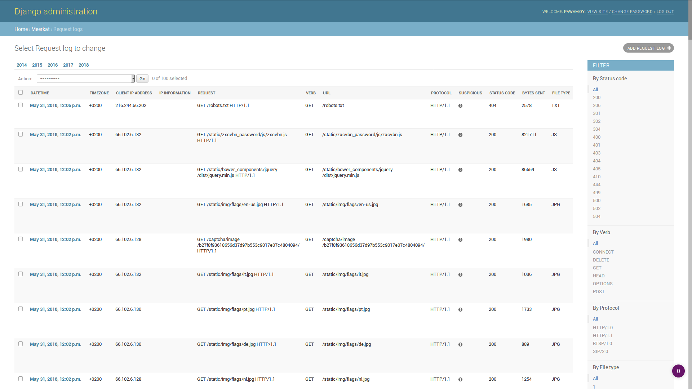
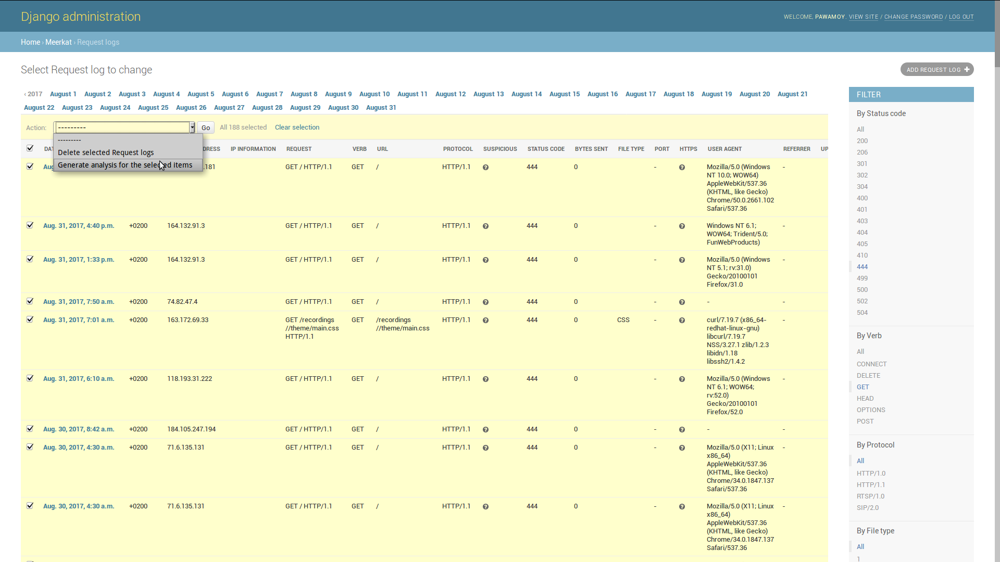
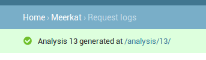
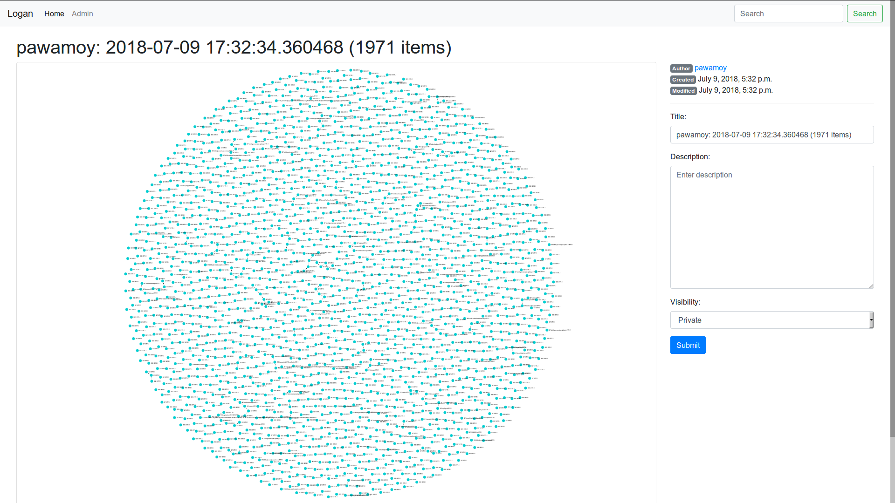
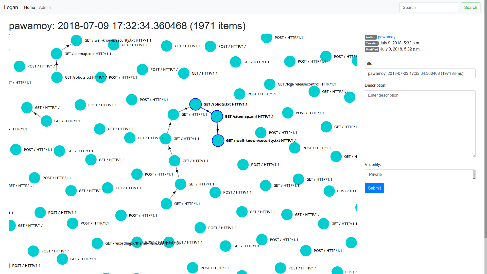
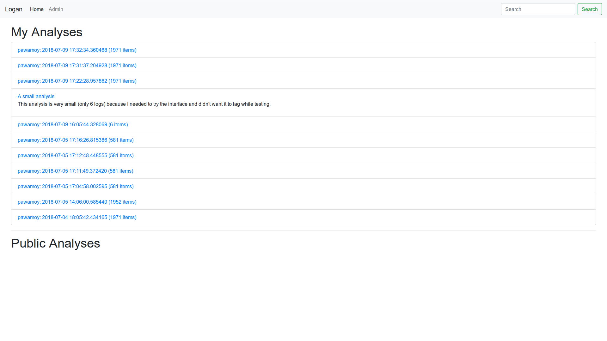

# Logan
Logan is a log analysis tool based on Django Meerkat.
For now it is a full Django project,
but the goal is to refactor it in a Meerkat plugin
once plugins are supported by Meerkat.

- [Installation](#installation)
- [Building](#building)
- [Loading fixtures](#loading-fixtures)
- [Running](#running)
- [Usage](#usage)

## Installation
This tool is not installable through pip yet.
Clone the repository with `git clone git@gitlab.com:pawamoy/logan`.

## Building
This project is executed through Docker.
Run the whole building process by typing `make` or `make all`,
or follow the step-by-step build below:

1. `make build` to build the Docker images;
2. `make up-no-start` to initialize the containers.
    It will actually create the database in the volume, which
    is necessary before trying to connect to the database in the next step;
3. `make build-database` to initialize the database (create the tables);
4. `make build-superuser` to create a super-user within the application;
5. See [Loading fixtures](#loading-fixtures) and [Running](#running) sections.

## Loading fixtures
Copy your NginX logs file in the repository.
The file must be named `nginx-access.log`.
Now run `make load-fixtures` to load the logs into the database.

## Running
To run the project, use the `make up` command.
Then go to [http://localhost:8000/admin](http://localhost:8000/admin)
and login with your super-user name and password.

## Usage
Once logged in, go to the requests logs page in the admin interface at
[http://localhost:8000/admin/meerkat/requestlogs](http://localhost:8000/admin/meerkat/requestlogs).
Use the available buttons and links to filter your selection.

Select one or more or all items in the current filtered queryset,
then click on the action called "Generate analysis for the selected items."

Once the analysis is done, a message will appear with the link to see it,
something like [/analysis/1](http://localhost:8000/analysis/1/).

Click on the link to go to the analysis page.

Use the mouse wheel to zoom/unzoom the graph.

You can see all the analysis you generated on the home page.

